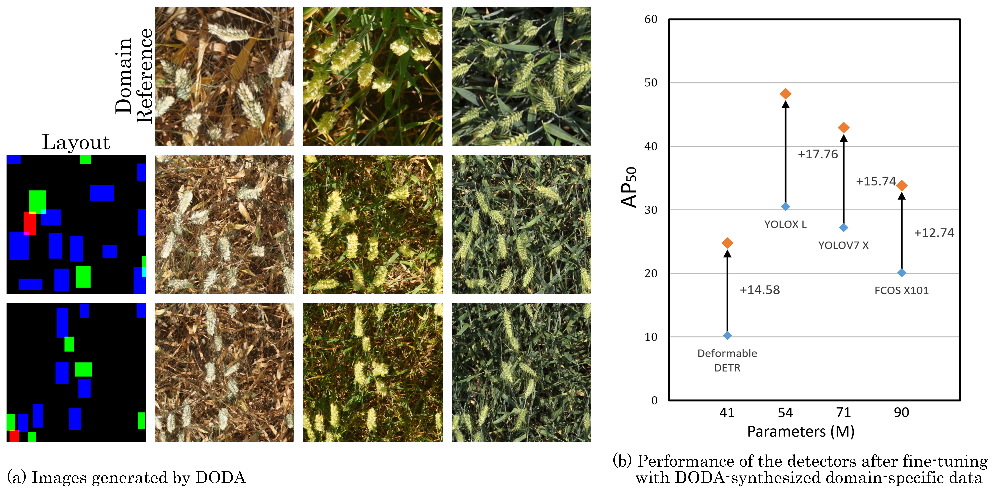
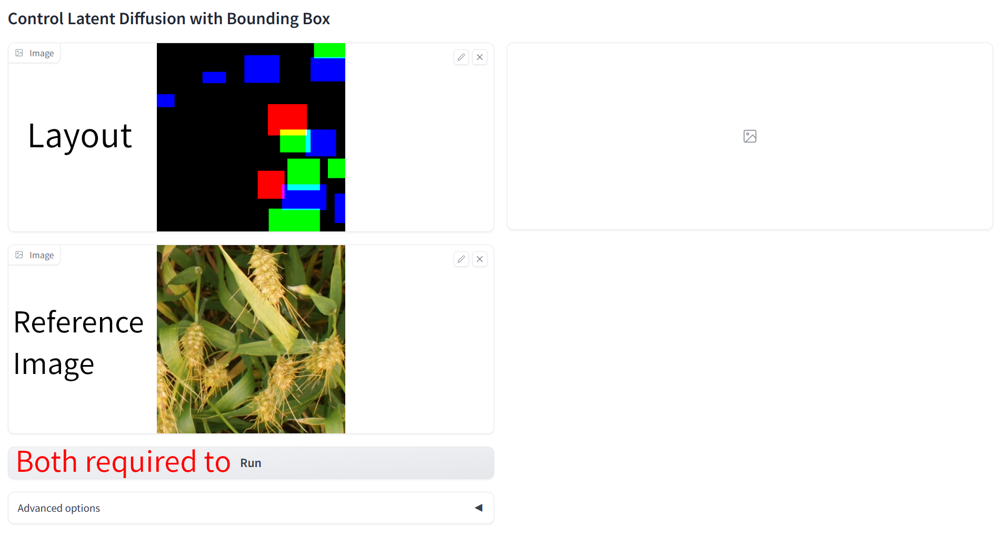

# DODA
Official implementation of Diffusion for Object-detection Domain Adaptation in Agriculture
DODA is a data synthesizer that can generate high-quality object detection data for new domains in agriculture, and help the detectors adapt to the new domains.



## Pretrained Models
| Model | Dataset | Resolution | Training Iters | Downlad Link |
|:-:|:-:|:-:|:-:|:-:|
|DODA-L2I|COCO|512x512|30K|[Google drive](https://drive.google.com/file/d/1Xm2gOA5QdtYyGQe6Lik-wXlyJTxFTc-F/view?usp=sharing)|
|DODA-L2I|COCO|256x256|100K|[Google drive](https://drive.google.com/file/d/1l4bJfBRqa0gyLgqpj6Fw1jHsXenEIz15/view?usp=sharing)|
|DODA|GWHD2021|256x256|80K|[Google drive](https://drive.google.com/file/d/1fR4yOhLDwTvyaP2l-TKi0iEApnXy60Lh/view?usp=sharing)|
|DODA-ldm|GWHD2021|256x256|315K|[Google drive](https://drive.google.com/file/d/1pHsJBmC5D33W8zmZoJfrjcayIzatlpn4/view?usp=sharing)|


## Evaluation

### Setup Environment
```
conda create -y -n DODA python=3.8.5
conda activate DODA
pip install torch==1.13.0+cu116 torchvision==0.14.0+cu116 --extra-index-url https://download.pytorch.org/whl/cu116
pip install -r requirements.txt
```

### Download Datesets
```
bash Download_dataset.sh
```

### Prepare Datesets
```
python prepare_coco.py
python prepare_wheat_trainset.py   # If you only want to test the model`s performance on GWHD, there is no need to run this line
python prepare_Terraref_testset.py
```

### Generate Images for Evaluation
Generate images according to the bounding boxes of the COCO 2017 validation set:
First download the pretrained DODA-L2I to `/models` folder, then run:
```
python generate_coco_testimg.py
```
Generate images according to the bounding boxes and reference images of the Terraref domain:
First download the pretrained DODA to `/models` folder, then run:
```
python prepare_Terraref_testset.py
```

If you want to generate data to train the detector, first generate layout images using `random_generate_layout_images.py`, then use `generate_data_for_target_domain.py` to generate the data.
If you want to generate data for your own domain, please refer to `generate_data_for_target_domain.py`

## Generate images in GUI
You can try our method to generate images for wheat through the GUI: 
```
python wheat_gradio_box2image.py
```

Please upload <u>**BOTH**</u> the <u>**reference image**</u> and <u>**layout**</u> image respectively as shown:



> PS: The demo <u>**reference image**</u> and <u>**layout**</u> can be found in the `/dataset` folder 

Or you can simply draw it yourself through drawing software. Each item should have a distinguishable color (with maximized values of the R, G, B channels), for example, `(0, 0, 255)`, `(255, 0, 255)`, etc. Below are some examples of possible layout images:


## Train your own DODA
You can download the pretained DODA-ldm, and run `tool_add_control.py` to add the ControlNet to the model:
```
python tool_add_wheat_control.py
```

the train the model by running:
```
python train_wheat.py
```

